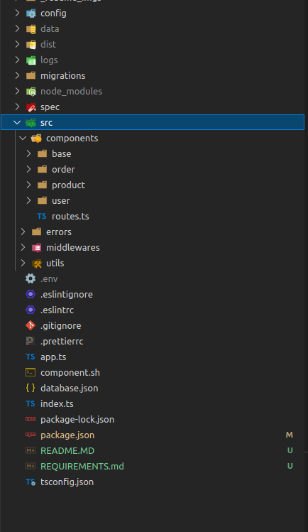

# Introduction

<p>E-commerce API made with typescript, express ,PostgreSQL with all the basic features and more !!</p>

# Technologies

- Nodejs
- Expressjs
- Typescript
- PostgreSQL
- db-migrate(tool) !important for doing migration stuff.

# File Structure



# Environment Variables

&nbsp;

```ENV
ENV=dev

DB_HOST=127.0.0.1
DB_NAME=store_front_api_dev
DB_USERNAME=admin_user

DB_TEST_NAME=store_front_test_api
DB_TEST_USERNAME=test_admin_user
DB_PASSWORD=password123
JWT_KEY=jsonwebtokensecret22

EXTRA_PASSWORD=22endof@year
```
# DB Setup
please note that this setup for linux users.
```
/* open your terminal */
sudo -u postgres psql

/* 
  - you need to creat two databases one for dev and another for test
  - follow the commands below to do that.
*/

CREATE USER username WITH PASSWORD 'password123';
CREATE DATABASE database_name;
\c database_name
GRANT ALL PRIVILEGES ON DATABASE database_name TO username;
```
&nbsp;
### Install db-migrate gloabally.
```
npm i -g db-migrate
```
# How to run 
- start the app:&nbsp;&nbsp; ``` npm start ```
- run the test:&nbsp;&nbsp; ```  npm run test ```

# API-ROUTES

⭕ YOU CAN ACCESS THE SERVER IN localhost:3000
```Base URL
http://localhost:3000/api/
```

&nbsp;

|            Routes             | Method |          Description          |        Schema                    |
| :---------------------------: | :----: | :---------------------------: | :---------------------------:    |
|                               | Users  
|      /api/users               |  POST  |        Register a User        |{firstname: string, lastname: string, email: string, password: string}
|      /api/users/login         |  POST  |         Login A user          |{email:string, password:"string"} |
|                               | Products  
|         /api/products         |  GET   |         Get Products          |
|      /api/products/:id        |  GET   |    Get Individual product     |
|     /api/product/:id          | DELETE |       Delete A Product        |
|      /api/products            |  POST  |       Insert A Product        |{price: number, title: string, summary:string, image_url:string}|
|      /api/products/:id        | PATCH  |        Update Product         |
|                               | Orders  
|      /api/orders              |  GET   |          Gets Order           |
|      /api/orders/:id          |  GET   | Get Individual Order Detailes |
|       /api/orders             |  POST  |     Add new order             |{customer_id: number, total: number, order_status: string, payment_type: string}
|       /api/orders/:id         | PATCH  |      Update Order             |
|       /api/orders/:id         | DELETE |      Delete Order             |
|   /api/orders/products        | POST   |   add products to order       |{products: [{product_id: number, quantity: number}]}
|     /api/orders/products/:pid | POST   |   add product to order        |{quantity: number}

&nbsp;
&nbsp;
### Please look at REQUIRMENT.md file to see the API routes.